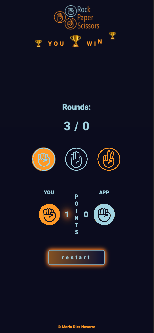

# rock-paper-scissors (mobile first & all screens)

[Deployment](https://mariariosnavarro.github.io/rock-paper-scissors/)

I test a lot of animations and features of css in this repository

# Iphone 12 Pro

# Iphone SE

# Ipad and Small Desktop

